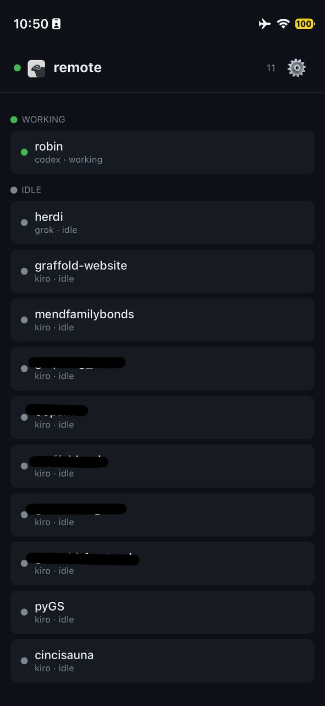
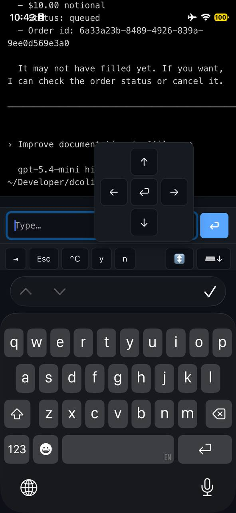

# herdr-remote

Monitor and approve [herdr](https://herdr.dev) agents from your phone, menu bar, or Telegram -- no SSH required.

**[Try the live demo](https://herdr-demo.pages.dev)** -- no install, works on any phone

## Install (macOS -- 10 seconds)

Download [Herdi.app](https://github.com/dcolinmorgan/herdr-remote/releases/latest) and drag to Applications. Done.

The menu bar app monitors all your local herdr agents automatically -- no relay, no config, no account.

Or via terminal:
```bash
curl -sL https://github.com/dcolinmorgan/herdr-remote/releases/latest/download/Herdi-0.5.0.dmg -o /tmp/Herdi.dmg && open /tmp/Herdi.dmg
```

## Screenshots

| Agent List | Terminal View |
|:--:|:--:|
|  |  |

## Remote monitoring (phone/Telegram)

For monitoring agents on remote machines or from your phone:

```bash
herdr plugin install dcolinmorgan/herdr-push
./relay/start.sh
```

Open [herdr-demo.pages.dev](https://herdr-demo.pages.dev) on your phone, paste the tunnel URL.

## Features

- **macOS menu bar app** -- see all agents at a glance, approve from desktop (zero config)
- **Web app** -- approve blocked agents from your phone with one tap
- **Telegram bot** -- /agents, /read, /send, /reply, /trust, /interrupt
- **Terminal TUI** -- kanban dashboard in a herdr pane
- **Agent timeline** -- track when agents worked, blocked, and finished
- **Daily digest** -- Telegram summary of agent activity
- **11 themes** -- dark, herdr, light, sand, clay, dune, nord, rose, dracula, kanagawa, midnight
- **Token auth** -- shared secret protects your relay
- **Zero-dep plugin** -- [`herdr-push`](https://github.com/dcolinmorgan/herdr-push) uses only `curl`

## Architecture

```
                    ┌──────────────────────────────┐
                    │  macOS Menu Bar (Herdi.app)   │ ← zero config, local
                    │  monitors herdr directly      │
                    └──────────────────────────────┘

┌──────────────┐  ┌──────────────┐  ┌──────────────┐
│  Web App     │  │  Telegram    │  │  TUI         │
│  (phone)     │  │  Bot         │  │  (terminal)  │
└──────┬───────┘  └──────┬───────┘  └──────┬───────┘
       │                  │                  │
       └───── WebSocket ──┴──────────────────┘
                   │
        ┌──────────┴──────────┐
        │   relay (:8375)     │  ← Cloudflare tunnel
        │   WS + HTTP POST    │
        └──────────┬──────────┘
                   │
     ┌─────────────┼─────────────┐
     │ local poll  │ herdr-push  │
     │ (herdr CLI) │ (HTTP POST) │
     │             │             │
  ┌──┴──┐    ┌────┴────┐   ┌────┴────┐
  │herdr│    │herdr    │   │herdr    │
  │local│    │remote A │   │remote B │
  └─────┘    └─────────┘   └─────────┘
```

## Telegram Bot

Full agent interaction from Telegram:

```bash
export HERDR_TG_TOKEN="your-token"
export HERDR_TG_CHAT_ID="your-chat-id"
uv run relay/herdr_telegram.py
```

Commands: `/agents` `/status` `/read` `/reply` `/send` `/trust` `/interrupt`

Notifications when agents block or finish.

## Web App

**[herdr-demo.pages.dev](https://herdr-demo.pages.dev)**

- Tap any agent to open a live terminal view
- Special mobile keyboard: Tab, Esc, ^C, y/n + floating arrow d-pad
- Agent icons: Kiro, Codex, Claude, Grok, Copilot auto-detected
- Context menu: open terminal, approve, read output, interrupt
- Quick-action buttons for blocked agents (yes/trust/no)
- Browser notifications when agents block
- PWA -- add to Home Screen for app-like experience

## Terminal TUI

```bash
uv run relay/herdr_tui.py
```

## Relay Setup

```bash
git clone https://github.com/dcolinmorgan/herdr-remote
cd herdr-remote/relay
./start.sh
```

Starts relay + Cloudflare tunnel, prints URL. See [QUICKSTART.md](QUICKSTART.md) for details.

## Token Auth

```bash
export HERDR_RELAY_TOKEN="$(openssl rand -hex 16)"
uv run relay/herdr_relay.py
```

## Native host power controls

The native relay accepts typed `wake_host` and `shutdown_host` operations when `HERDR_POWER_HOST_ID` and `HERDR_POWER_HOST_MAC` are configured. Wake runs `wakeonlan` locally; shutdown uses the configured preset SSH target and the fixed command `sudo -n systemctl poweroff`. The relay never accepts shell text from a client.

## Requirements

- macOS 14+ (menu bar app)
- Python 3.10+ with [uv](https://docs.astral.sh/uv/) (relay/TUI/bot)
- `cloudflared` (for remote access)
- herdr 0.7+
