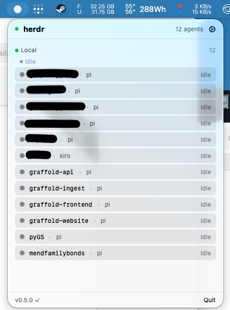
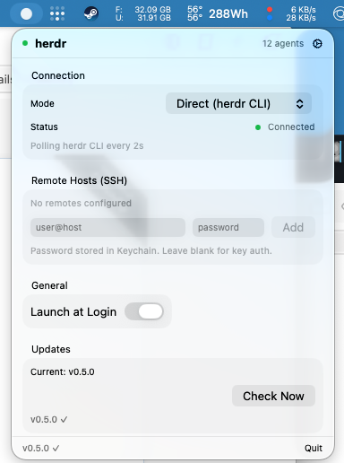
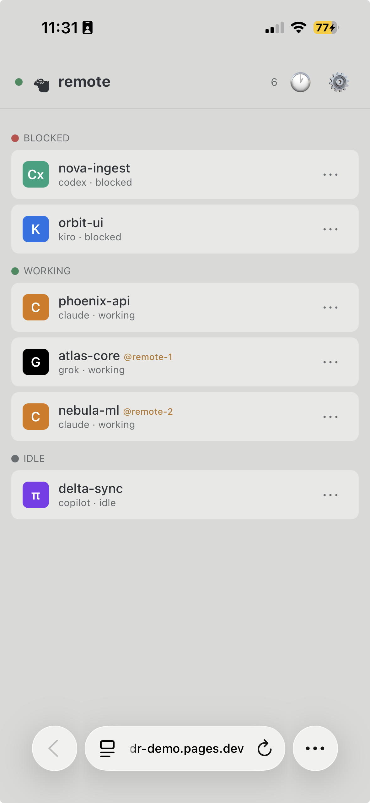
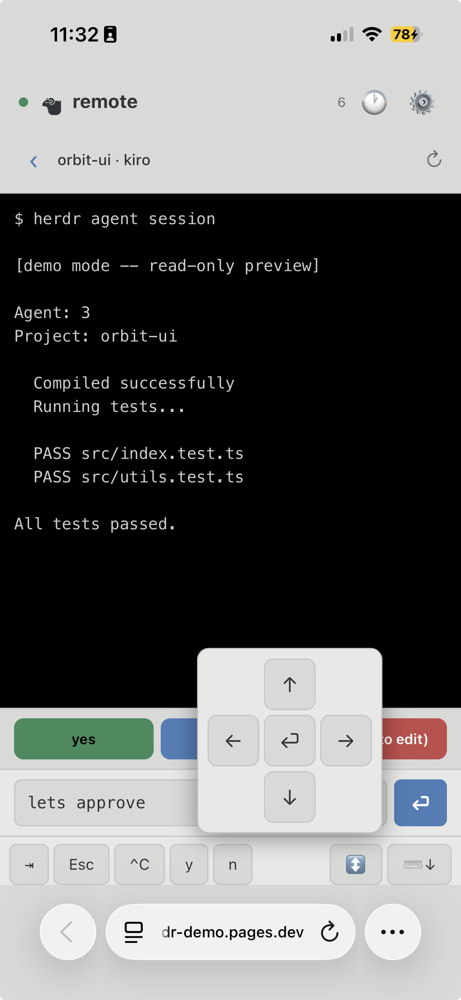

# herdr-remote

Agent dashboard for [herdr](https://herdr.dev) -- menu bar, phone, Telegram. Zero config locally, free tunnel for remote.

**[Try the live demo](https://herdr-demo.pages.dev)**

## Install (10 seconds)

Download [Herdi.app](https://github.com/dcolinmorgan/herdr-remote/releases/latest) and drag to Applications.

Monitors all your local herdr agents automatically -- no relay, no config, no account.

```bash
curl -sL https://github.com/dcolinmorgan/herdr-remote/releases/latest/download/Herdi-0.6.0.dmg -o /tmp/Herdi.dmg && open /tmp/Herdi.dmg
```

## What you get

- **Live agent timeline** -- who worked when, who blocked, who finished
- **One-tap approvals** from phone, menu bar, or Telegram
- **Daily activity digest** -- `/digest` in Telegram shows working time + block count
- **Terminal interaction** -- read output, send commands, interrupt agents remotely
- **Notifications** -- know instantly when agents need you or finish
- **11 themes** -- dark, herdr, light, sand, clay, dune, nord, rose, dracula, kanagawa, midnight

## Screenshots

| Menu Bar App | Settings |
|:--:|:--:|
|  |  |

| Agent List | Terminal View |
|:--:|:--:|
|  |  |

## Remote monitoring (phone/Telegram)

For monitoring agents across machines or from your phone:

```bash
herdr plugin install dcolinmorgan/herdr-push
cd herdr-remote/relay && ./start.sh
```

Open [herdr-demo.pages.dev](https://herdr-demo.pages.dev) on your phone, paste the tunnel URL.

## Telegram Bot

Full agent interaction:

```bash
export HERDR_TG_TOKEN="your-token"
export HERDR_TG_CHAT_ID="your-chat-id"
uv run relay/herdr_telegram.py
```

| Command | Action |
|---------|--------|
| `/agents` | List all with status |
| `/read` | Read agent output |
| `/reply` | Read + respond in one flow |
| `/send` | Send text to an agent |
| `/trust` | Trust all tools for blocked agent |
| `/interrupt` | Send Ctrl+C |
| `/digest` | Today's activity summary |

## Architecture

```
                    ┌──────────────────────────────┐
                    │  macOS Menu Bar (Herdi.app)   │ <- zero config
                    └──────────────────────────────┘

┌──────────────┐  ┌──────────────┐  ┌──────────────┐
│  Web App     │  │  Telegram    │  │  TUI         │
│  (phone)     │  │  Bot         │  │  (terminal)  │
└──────┬───────┘  └──────┬───────┘  └──────┬───────┘
       │                  │                  │
       └───── WebSocket ──┴──────────────────┘
                   │
        ┌──────────┴──────────┐
        │   relay (:8375)     │  <- Cloudflare tunnel
        └──────────┬──────────┘
                   │
     ┌─────────────┼─────────────┐
     │ local poll  │ herdr-push  │
     │ (herdr CLI) │ (HTTP POST) │
     └──────┬──────┘──────┬──────┘
         ┌──┴──┐     ┌────┴────┐
         │herdr│     │herdr    │
         │local│     │remote   │
         └─────┘     └─────────┘
```

## Terminal TUI

```bash
uv run relay/herdr_tui.py
```

## Token Auth

```bash
export HERDR_RELAY_TOKEN="$(openssl rand -hex 16)"
uv run relay/herdr_relay.py
```

## Requirements

- macOS 14+ (menu bar app)
- Python 3.10+ with [uv](https://docs.astral.sh/uv/) (relay/TUI/bot)
- `cloudflared` (for remote access)
- herdr 0.7+
- Zero-dep plugin: [`herdr-push`](https://github.com/dcolinmorgan/herdr-push)

## Changelog

### v0.6.0

- **Workspace drill-down** — agents grouped by workspace/space; blocked "Needs you" agents hoisted to top of dashboard before workspace cards
- **Prettier cards** — shadcn-style: 12px radius, subtle borders, hover lift/shadow, `active:scale(0.99)`, cwd display, chevron navigation
- **Web Push (VAPID)** — subscribe in Settings; get notified when agents block even with tab closed; auto-clears when agent unblocks
- **Structured audit log** — all write actions (respond, send_text, send_keys) logged as JSONL to `~/Library/Logs/herdr-remote/audit.log`
- **Push collapse + TTL** — offline devices get only the latest notification (Topic: `herdr-herd`, TTL: 6h), not a burst of stale alerts
- **Count pills** — workspace cards show pane/tab counts at a glance

### v0.5.0

Telegram bot (`/agents /read /send /reply /trust /interrupt`), demo bot, linux setup script.
